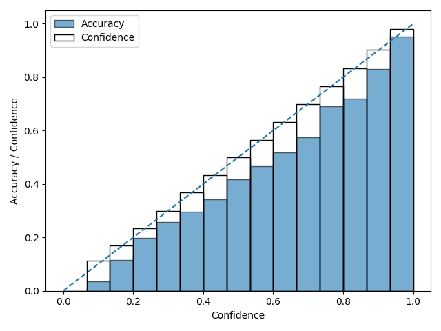

# Deep-Learning-Project
A toy example of deep learning projects on model architecture.

## Quick reproduction

Reproduce the Dense baselines (ResNet-18 on CIFAR):

```bash
# CIFAR-100 dense baseline
python bayes-moe/train_dense.py --cfg bayes-moe/configs/cifar100_resnet18.yaml

# CIFAR-10 dense baseline
python bayes-moe/train_dense.py --cfg bayes-moe/configs/cifar10_resnet18.yaml
```

Produced artifacts (examples):

- `bayes-moe/runs/cifar100-resnet18/results.csv` — per-run CSV summary
- `bayes-moe/runs/cifar100-resnet18/metrics.txt` — human-readable metrics
- `bayes-moe/runs/cifar100-resnet18/reliability.png` — reliability diagram
- `bayes-moe/runs/cifar100-resnet18/ckpt.pt` — final checkpoint (state_dict)

Example run summaries (metrics):

- CIFAR-100 (ResNet-18): acc=0.5655, ece=0.0704, nll=1.6408 (see `bayes-moe/runs/cifar100-resnet18/metrics.txt`)
- CIFAR-10 (ResNet-18): acc=0.8295, ece=0.0297, nll=0.4951 (see `bayes-moe/runs/cifar10-resnet18/metrics.txt`)

Place your own runs under `bayes-moe/runs/<your-exp-name>/` following the same layout.

<!-- thumbnail for CIFAR-100 reliability plot -->
<p align="center">
	
</p>

Figure: Reliability diagram (thumbnail) for CIFAR-100 ResNet-18. Full image at `bayes-moe/runs/cifar100-resnet18/reliability.png`.

<p align="center">
	
</p>

Figure: Reliability diagram (thumbnail) for CIFAR-10 ResNet-18. Full image at `bayes-moe/runs/cifar10-resnet18/reliability.png`.
