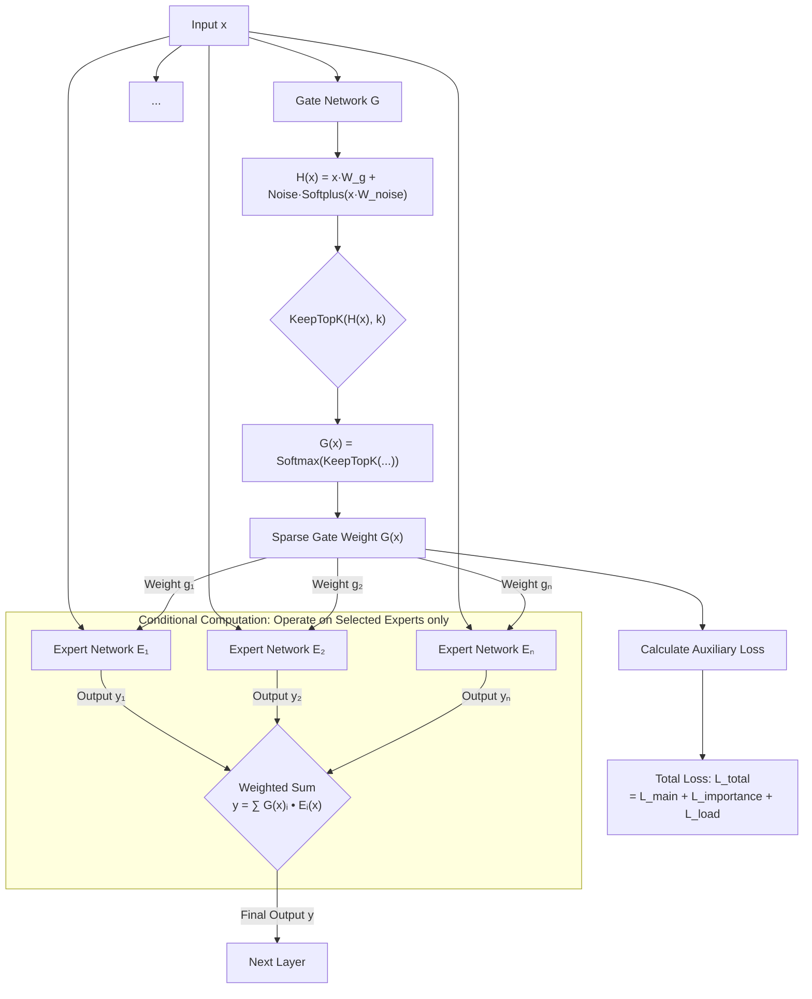

# Related Work

**Table of Contents:**
- [Work Related to Mixture of Experts](https://github.com/Pseudonymous-gdy/Deep-Learning-Project/blob/main/bayes-moe/notes/related_work.md#Mixture-of-Experts)
  - [Shazeer17: Sparsely-Gated MoE](https://github.com/Pseudonymous-gdy/Deep-Learning-Project/blob/main/bayes-moe/notes/related_work.md#shazeer17sparsely-gated-moe)
    - [Gating Computation](https://github.com/Pseudonymous-gdy/Deep-Learning-Project/blob/main/bayes-moe/notes/related_work.md#1-gating-computation)
    - [Conditional Computation](https://github.com/Pseudonymous-gdy/Deep-Learning-Project/blob/main/bayes-moe/notes/related_work.md#2-conditional-computation)
    - [Output & Auxiliary Loss](https://github.com/Pseudonymous-gdy/Deep-Learning-Project/blob/main/bayes-moe/notes/related_work.md#3-output--auxiliary-loss)
    - [Flow Chart](https://github.com/Pseudonymous-gdy/Deep-Learning-Project/blob/main/bayes-moe/notes/related_work.md#4-flow-chart)
  - [Fedus21：Switch Transformer](https://github.com/Pseudonymous-gdy/Deep-Learning-Project/blob/main/bayes-moe/notes/related_work.md#fedus21switch-transformer)
    - [Switch Routing vs. MoE](https://github.com/Pseudonymous-gdy/Deep-Learning-Project/blob/main/bayes-moe/notes/related_work.md#1switch-routing-vsmoe)
    - [Engineering Issues](https://github.com/Pseudonymous-gdy/Deep-Learning-Project/blob/main/bayes-moe/notes/related_work.md#2engineering-issues)
- [Work Related to Bayesian DL](https://github.com/Pseudonymous-gdy/Deep-Learning-Project/blob/main/bayes-moe/notes/related_work.md#Bayesian-Deep-Learning)

---
## Mixture of Experts
This part records previous works related to MoE architecture.
### Shazeer17：Sparsely-Gated MoE

#### 1. Gating Computation
  - add controllable noise:
    $$H(x) \gets (X \cdot W_g) + \text{StandardNormal}() \cdot \text{Softplus}(x \cdot W_{\text{noise}})$$
  - select only top-k gates
  - softmax application
#### 2. Conditional Computation
  - conduct only on non-zero weighted experts (**to realize sparsity**)
#### 3. Output & Auxiliary Loss
  - take the weighted sum
  - compute Loss of Importance $L_\text{importance}$ and Loss of Load $L_\text{load}$
  - combine them with main loss as objective function for optimization.
#### 4. Flow Chart

### Fedus21：Switch Transformer
Compared to the previous one, this paper focus more on the efficiency rather than accuracy.
#### 1. Switch Routing vs. MoE
Compared with `top-K` strategy in [Gating Computation](https://github.com/Pseudonymous-gdy/Deep-Learning-Project/blob/main/bayes-moe/notes/related_work.md#1-gating-computation), this paper applies the strategy of **assigning `K=1`**. A comparison is given:

|| MoE (Top-K, K$\geq$2, normally K=2) | Switch Transformer (Top-1) |
| --- | --- | --- |
| Motivation | Provide Gradient Signals for Routing to Compare between Experts | Simplify the Calculation by 1/K |
| Issues | Computationally Exhaustive | No Gradient Signals for Comparison |

Based on the discussion above, one solution to `Switch Transformer` is to backpropagate through gate weights, which contains the probability information of all experts. Basically, the gradient follows for the selected one expert $i$,

$$\frac{\partial L}{\partial y}\cdot\frac{\partial y}{\partial p_i(x)}\cdot\frac{\partial p_i(x)}{\partial W_r}=\frac{\partial L}{\partial y}\cdot E_i(x)\cdot\frac{\partial p_i(x)}{\partial W_r}$$

which indicates that a high probability assigned to Expert $i$ is good/bad. For other expert and distributions, the gradient information is 0.

#### 2. Engineering Issues
Key features include:
##### 1. Selective Precision
- **Problem:** Using effective precision in training might leads to fluctuation when calculating Softmax in Sparse Conditions.
- **Resolution:** Only change the precision in Gate Computation to float32.
##### 2. Reduced Initialization
- **Problem:** Large-scale models are sensitive to hyperparameter initializations, which might cause gradient explosion.
- **Resolution:** Reduce the scale to 1/10 when initializing.
##### 3. Expert Regularization
- **Problem:** Sparse model has large scale hyperparameters, while supervised fine tuning has few training data, which might lead to overfitting.
- **Resolution:** Apply stronger `Dropout` layer to `FFN layer` of Experts and weaker `Dropout` layer to non-expert layer, i.e., `Attention layer`.
##### 4. Differentiable Load Balancing Loss
- **Problem:** Model tends to train on specific experts while ignoring others.
- **Resolution:** Set Loss Functions of:

$$\text{loss}=\alpha\cdot N\cdot\sum_{i=1}^N (f_i\cdot P_i)$$

where $P_i=\frac{1}{T}\sum_{x\in\mathcal{B}}p_i(x),f_i=\frac{1}{T}\cdot\sum_{x\in\mathcal{B}}\mathbb{1}(\arg\max{p(x)=i})$. Then, we try to figure out a pareto frontier of the loss function (namely this loss and the main loss - Cross Entropy in Language Modeling).

## Bayesian Deep Learning

