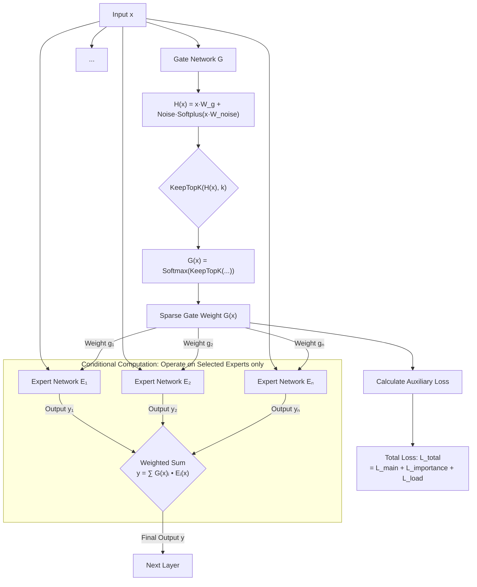

# Related Work

**Table of Contents:**
- [Work Related to Mixture of Experts](Mixture-of-Experts)
  - [Shazeer17: Sparsely-Gated MoE](shazeer17sparsely-gated-moe)
    - [Gating Computation](1-Gating-Computation)
    - [Conditional Computation](2-Conditional-Computation)
    - [Output & Auxiliary Loss](3-Output-&-Auxiliary-Loss)
    - [Flow Chart](4-Flow-Chart)
- [Work Related to Bayesian DL](Bayesian-Deep-Learning)

---
## Mixture of Experts
This part records previous works related to MoE architecture.
### Shazeer17：Sparsely-Gated MoE

#### 1. Gating Computation
  - add controllable noise:
    $$H(x) \gets (X \cdot W_g) + \text{StandardNormal}() \cdot \text{Softplus}(x \cdot W_{\text{noise}})$$
  - select only top-k gates
  - softmax application
#### 2. Conditional Computation
  - conduct only on non-zero weighted experts (**to realize sparsity**)
#### 3. Output & Auxiliary Loss
  - take the weighted sum
  - compute Loss of Importance $L_\text{importance}$ and Loss of Load $L_\text{load}$
  - combine them with main loss as objective function for optimization.
#### 4. Flow Chart

## Bayesian Deep Learning

